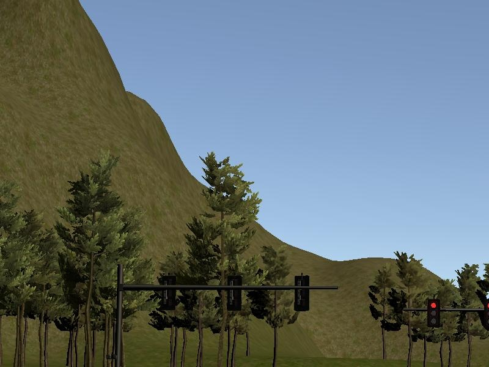
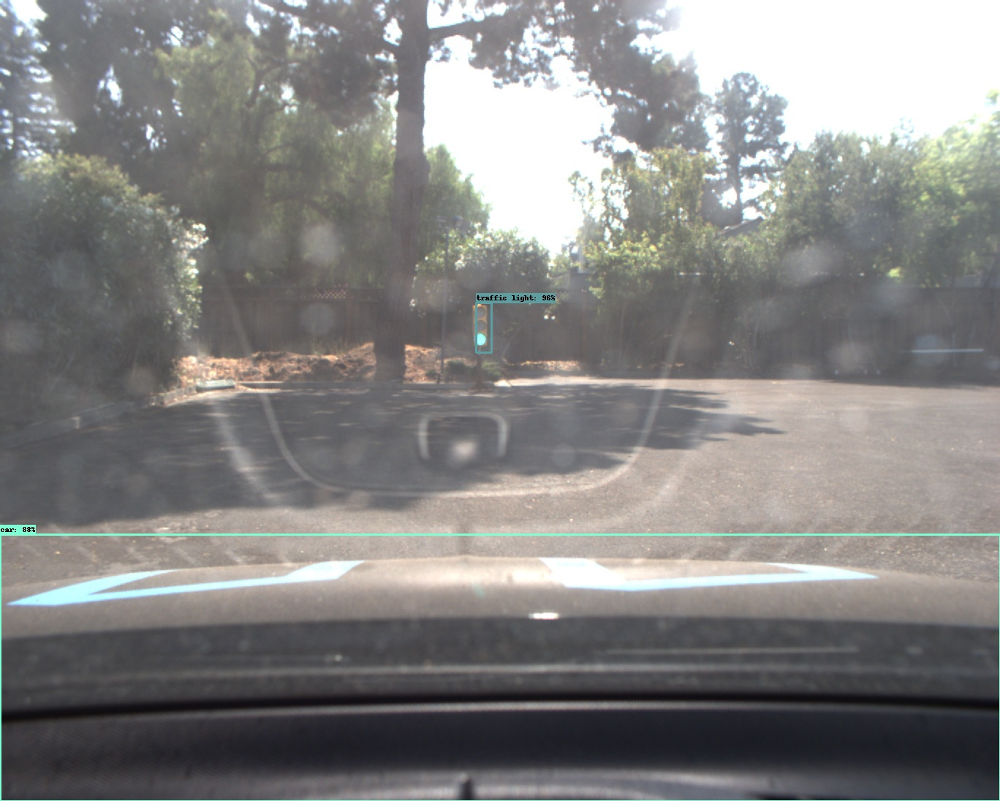
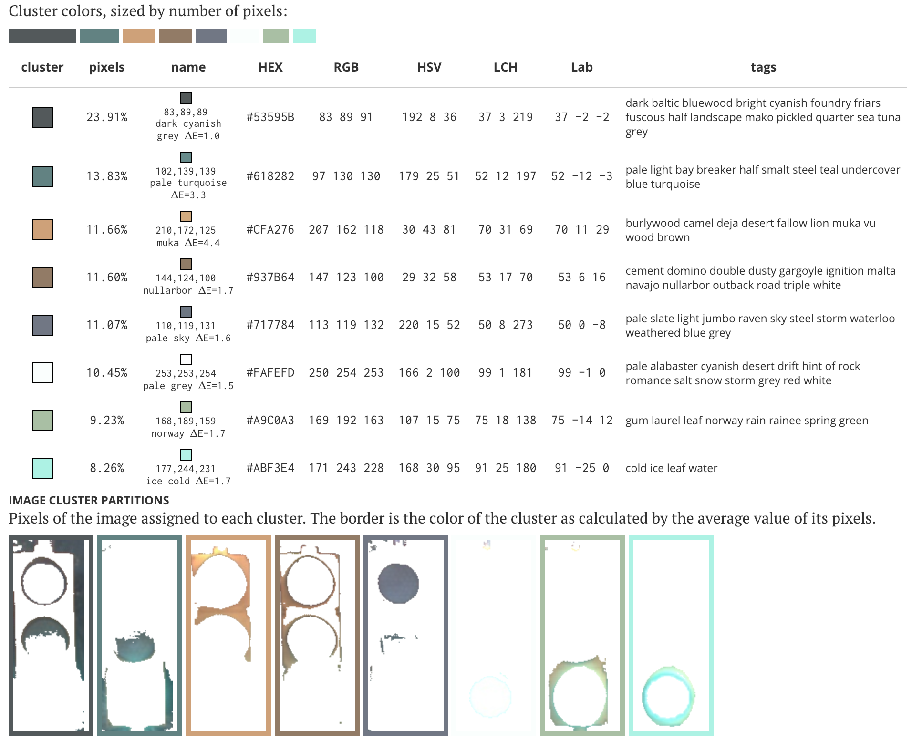
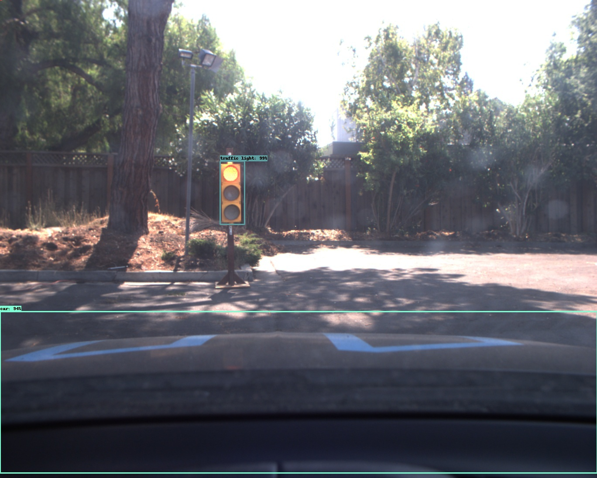
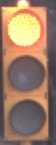
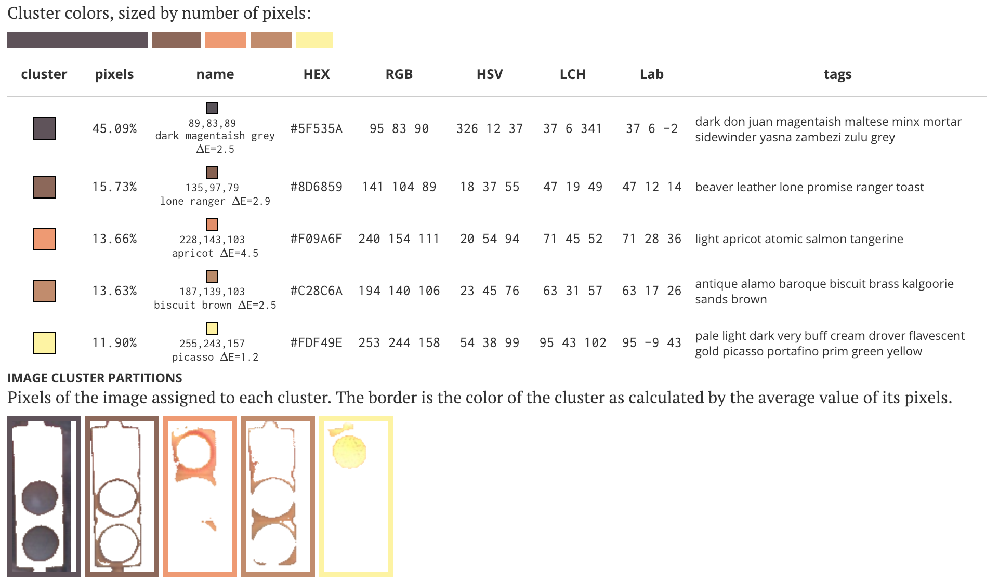

##### omar benzakour (omar.benzakour@gmail.com)
---

## Goals


This is the project repo for the final project of the Udacity Self-Driving Car Nanodegree: Programming a Real Self-Driving Car. In this project, we will implement Carla's different ROS nodes that you can see in the following system diagram


## Set up

Please use **one** of the two installation options, either native **or** docker installation.

### Native Installation

* Be sure that your workstation is running Ubuntu 16.04 Xenial Xerus or Ubuntu 14.04 Trusty Tahir. [Ubuntu downloads can be found here](https://www.ubuntu.com/download/desktop).
* If using a Virtual Machine to install Ubuntu, use the following configuration as minimum:
  * 2 CPU
  * 2 GB system memory
  * 25 GB of free hard drive space

  The Udacity provided virtual machine has ROS and Dataspeed DBW already installed, so you can skip the next two steps if you are using this.

* Follow these instructions to install ROS
  * [ROS Kinetic](http://wiki.ros.org/kinetic/Installation/Ubuntu) if you have Ubuntu 16.04.
  * [ROS Indigo](http://wiki.ros.org/indigo/Installation/Ubuntu) if you have Ubuntu 14.04.
* [Dataspeed DBW](https://bitbucket.org/DataspeedInc/dbw_mkz_ros)
  * Use this option to install the SDK on a workstation that already has ROS installed: [One Line SDK Install (binary)](https://bitbucket.org/DataspeedInc/dbw_mkz_ros/src/81e63fcc335d7b64139d7482017d6a97b405e250/ROS_SETUP.md?fileviewer=file-view-default)
* Download the [Udacity Simulator](https://github.com/udacity/CarND-Capstone/releases).

### Docker Installation
* [Install Docker](https://docs.docker.com/engine/installation/)

* Build the docker container
```bash
docker build . -t capstone
```

* Run the docker file
```bash
docker run -p 4567:4567 -v $PWD:/capstone -v /tmp/log:/root/.ros/ --rm -it capstone
```

### Port Forwarding

The system integration project uses its own simulator which will interface with your ROS code and has traffic light detection. You can download the simulator [here](https://github.com/udacity/CarND-Capstone/releases). To improve performance while using a VM, we recommend downloading the simulator for your host operating system and using this outside of the VM. You will be able to run project code within the VM while running the simulator natively in the host using port forwarding on port 4567

### Usage

1. Install python dependencies
```bash
cd CarND-Capstone
pip install -r requirements.txt
```
2. Make and run styx
```bash
cd ros
catkin_make &&
source devel/setup.sh &&
roslaunch launch/styx.launch
```
3. Run the simulator

<!--catkin_make && source devel/setup.sh && roslaunch launch/styx.launch -->


## Red light detector simulation (code in traffic\_light_detection/simulation)


Because there is nothing red but the red lights in the simulator, we can use open cv methods and count the number of red pixels in the camera's image to detect red lights. Indeed training a NN for red light detection in a simulator is really overkill. Deeplearning comes handy if we the red lights come under different light conditions, positions, form and also also types (e.g red light for going left or right)

#### captured image




#### Masked image


## Red light detector in real environment (code in traffic\_light_detection/real_ environment)


We can take several approaches to solve this, let us list them in this section:

- Using the ROS bag images, we can train a simple Neural network to detect the red light in the parking. We wouldn't do any processing to the data byt instead use an end to end NN. In order to do so we would have to manually label the images containing a red light. Our solution would therefore overfit the use case and would probably pass the test. This solution needs a lot of work since it requires us to manually label data
-  Instead of labeling the data ourselves , we can use traffic light datasets. We will for example start with a neural network that performed well with the ROCO dataset. We will then train this neural network on the provided traffic light dataset and then use it on the bag images for validation. This solution requires less work than the first solution but requires training which take time 
-  The last solution takes advantage of the fact that the ROCO dataset contains the traffic light class. We can therefore use a coco trained model to detect if the traffic light is present or not in the picture. If so, we take the box containing the traffic light and count the number of pixels in the first third the bounding box, the number of yellow pixels in the mid 2nd third of the bounding box ... This method doesn't require much work and can be quickly tested


### Applying the 3rd solution (Results)

#### green traffic light image after NN



#### green traffic light image


#### green traffic light image analysis from http://mkweb.bcgsc.ca



#### green traffic light cropped and filtered

   We managed to correctly classify the traffic light

#### red traffic light image after NN



#### red traffic light image



#### red traffic light image analysis from http://mkweb.bcgsc.ca



#### red traffic light cropped and filtered

   We managed to correctly classify the traffic light
  
  
## Waypoint updated Node


The node updates the speed and position of the the waypoints that we are going to follow based on the base waypoints, our original waypoints and the traffic light / obstacles


## DBW Node


Using several controllers, this nodes updates the steering, break and throttle of the car. The acceleration is controled by a simple PID controller


### Real world testing
1. Download [training bag](https://s3-us-west-1.amazonaws.com/udacity-selfdrivingcar/traffic_light_bag_file.zip) that was recorded on the Udacity self-driving car.
2. Unzip the file
```bash
unzip traffic_light_bag_file.zip
```
3. Play the bag file
```bash
rosbag play -l traffic_light_bag_file/traffic_light_training.bag
```
4. Launch your project in site mode
```bash
cd CarND-Capstone/ros
roslaunch launch/site.launch
```
5. Confirm that traffic light detection works on real life images
